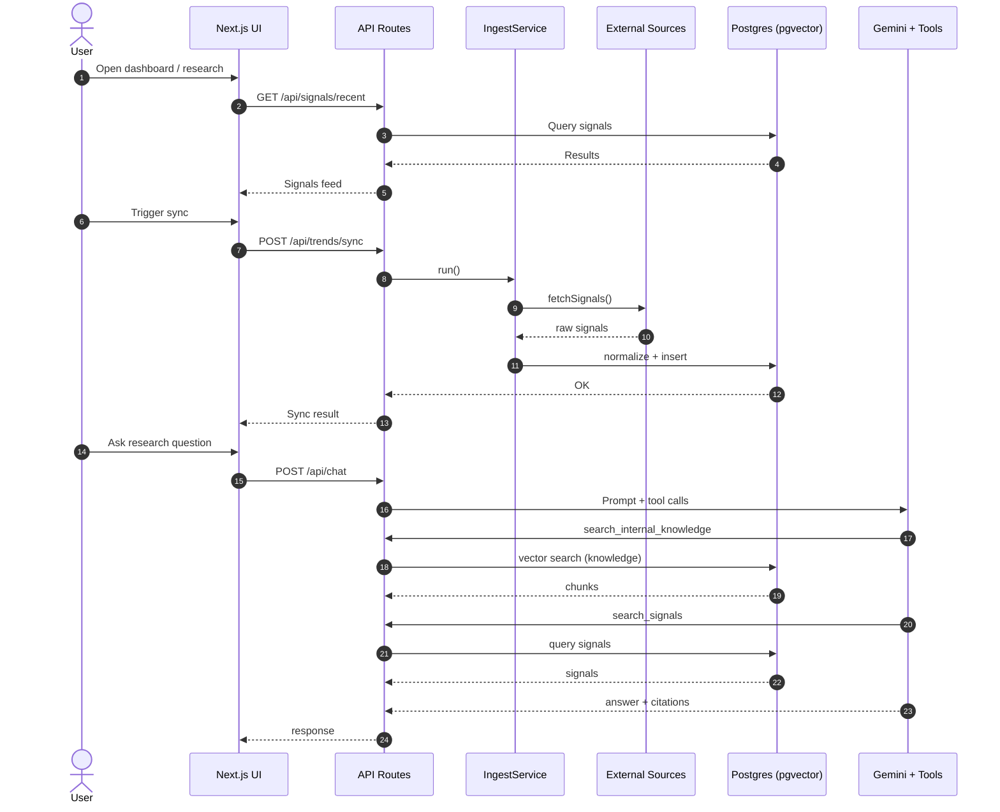

# Shibuya Consumer Research - Project Overview

## What this project is

Shibuya Research is an AI-powered consumer research and signal intelligence cockpit. It collects signals from public sources (Reddit, Product Hunt, app stores, etc.), stores them for analysis, and lets you query them alongside internal documents with an AI research assistant.

Primary capabilities:

- Signal ingestion and normalization from multiple sources.
- Live signals feed for browsing recent items.
- Internal knowledge base ingestion (text and PDF) with semantic search.
- AI chat that combines internal knowledge + external signals.

## High-level architecture

```
External sources -> IngestService -> normalize -> Postgres (signals)
Internal docs -> ingest APIs -> chunk + embed -> Postgres (knowledge)
UI pages -> API routes -> Postgres -> UI
AI chat -> Gemini tools -> signals/knowledge + DB -> response
```

## UML diagram (Mermaid)



## Core components

### Frontend (Next.js App Router)

- `app/page.tsx`: home dashboard + knowledge panel.
- `app/signals/page.tsx`: live signals feed (server-rendered).
- `app/research/page.tsx`: research cockpit (client UI with chat + top apps).

### API layer (Next.js route handlers)

- `app/api/trends/sync`: runs ingestion; used by UI autosync + Vercel cron.
- `app/api/signals/recent`: returns the latest signals.
- `app/api/apps`: latest app store signals (deduped).
- `app/api/knowledge/*`: ingest text/PDF, search, get/delete docs.
- `app/api/chat`: Gemini-powered research assistant with tool calls.
- `app/api/conversations`, `app/api/chat/history`: chat history storage.

### Ingestion + normalization

- `lib/ingestion/ingest.ts`: orchestrates sources, dedupes by URL/time, and saves signals.
- `lib/ingestion/normalize.ts`: cleans text and normalizes URLs + metadata.
- `lib/data-sources/*`: per-source clients.

Active sources wired into ingestion:
`reddit`, `producthunt`, `appstore`, `playstore`, `hackernews`, `rss-feeds`,
`yc-companies`, `gdelt`.

### Knowledge base + embeddings

- `lib/knowledge/chunking.ts`: chunking + token estimation.
- `lib/knowledge/embeddings.ts`: OpenAI text-embedding-3-large embeddings.
- `app/api/knowledge/search`: pgvector similarity search.

### Data store

Postgres (Neon) + Drizzle ORM with pgvector.

Key tables:

- `signals`: raw external signals.
- `threads`, `thread_items`: clustering (schema exists, clustering not wired yet).
- `knowledge_docs`, `knowledge_chunks`: internal knowledge base.
- `conversations`, `chat_messages`: chat sessions + history.

## Runtime data flow

1. Ingestion runs on demand (UI autosync) or hourly (Vercel cron).
2. Signals are normalized and stored in `signals`.
3. UI pages query the DB directly (server components) or via API routes.
4. Internal docs are chunked + embedded into `knowledge_chunks`.
5. Chat queries:
   - Internal knowledge (vector search),
   - External signals (DB search + filters),
   - Optional cached signal snapshot from the client.

## Configuration

Env vars (see `env.example`):

- `DATABASE_URL`: Postgres connection with pgvector.
- `GOOGLE_GENERATIVE_AI_API_KEY` or `GEMINI_API_KEY`: Gemini chat model.
- `OPENAI_API_KEY`: embeddings for internal knowledge.

Monitoring scope lives in `lib/config.ts` (subreddits, feeds, app store config).

## Repository layout

- `app/`: Next.js pages + API routes.
- `lib/`: ingestion, data sources, DB, knowledge, client stores.
- `drizzle/`: migrations.
- `types/`: shared type definitions.

## Notes / current gaps

- The home page links to `/trends`, but there is no UI page yet.
- The `threads` tables exist; clustering logic is not wired in this build.
